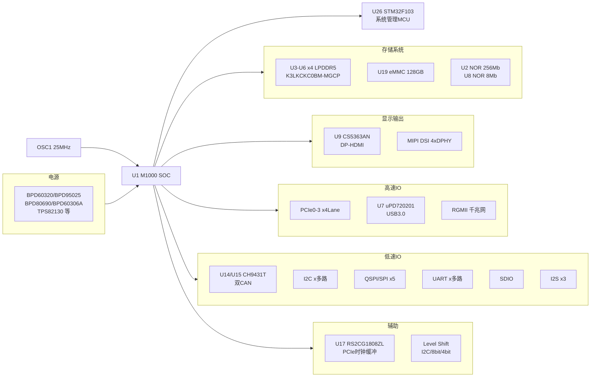
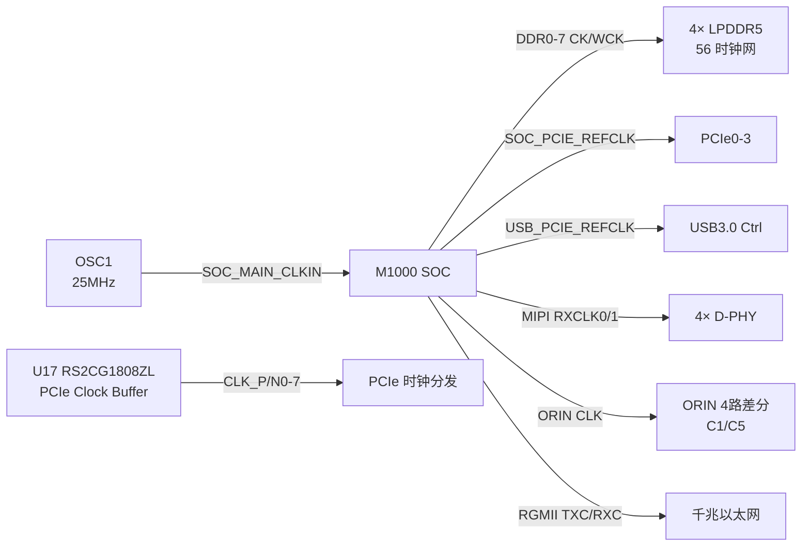

# M20 系统级电路分析报告

> 分析日期：2026-07-06 | 基于网表：`pstxprt.dat` / `pstxnet.dat` | 原理图：44 页 (Page 5-48)

## 架构速览

M20 是基于 **M1000 SOC** 的高性能嵌入式计算模块，搭载 4× LPDDR5、128GB eMMC、双 CAN、多路显示输出（DP/HDMI/MIPI），并集成 STM32F103 MCU 作为系统管理协处理器。整体架构如下：



## 主要器件

| 位号 | 型号 | 功能 | 备注 |
|------|------|------|------|
| U1 | M1000 | 主 SOC | 核心处理器 |
| U3, U4, U5, U6 | LPDDR5 BGA315 (Samsung K3LKCKC0BM-MGCP) | 4 通道 LPDDR5 内存 | 每颗 BGA315 封装 |
| U2 | PY25Q256HB-SUH-IT | SPI NOR Flash 256Mb | Boot 存储 |
| U8 | GD25Q80CSIG | SPI NOR Flash 8Mb | 辅助存储 |
| U19 | FEMDRW128G-88A19 | eMMC 128GB | 大容量存储 |
| U7 | uPD720201K8 | USB 3.0 Host 控制器 | PCIe→USB3.0 |
| U9 | CS5363AN | DP→HDMI 转换器 | 显示输出 |
| U10, U34, U39 | PCA9306 / NCA9306 | I2C 双向电平转换 | |
| U11, U12, U18, U21 | CH482X / CH442E | 模拟开关 | 信号切换 |
| U14, U15 | CH9431T | 双 CAN 控制器 | SPI 接口 |
| U16, U54 | TXS0108 | 8 位双向电平转换 | |
| U17 | RS2CG1808ZL | PCIe 时钟缓冲器 | 8 路差分输出 |
| U25, U27, U28, U29 | SN74AVC4T245 | 4 位双电源总线收发器 | 电平转换 |
| U26 | STM32F103C8T6 | 系统管理 MCU | Cortex-M3 |
| U32-U49 | BPD60320A / BPD95025 / BPD80690 / BPD60306A / TPS82130 等 | 电源管理 IC | 多路 DC-DC / LDO |
| OSC1 | CO21H4-25.000 | 25MHz 主时钟晶振 | SOC 主时钟源 |

## 接口清单

### 高速接口

| 接口 | 网络数 | 说明 |
|------|--------|------|
| **DDR** | 314 | 8 通道 DDR0-DDR7，每通道含 CK/WCK/CA/DQ |
| **PCIe** | 131 | PCIE0-3 四通道 + USB_PCIE |
| **DP** | 74 | DP2 4-Lane + AUX |
| **HDMI** | 39 | CK + 3 Data 通道 |
| **MIPI** | 44 | 4× D-PHY，每路含 CLK |
| **USB** | 38 | 含 USB 3.0 |
| **eMMC** | 24 | CLK/CMD/D0-D7 |

### 中低速接口

| 接口 | 网络数 | 说明 |
|------|--------|------|
| **QSPI/SPI** | 42 | SPI0-4 |
| **I2C** | 30 | 多路 I2C 总线 |
| **CAN** | 4 | CAN1/CAN2 RX+TX |
| **RGMII** | 14 | 含 MDC/MDIO/TXC/RXC 等 |
| **I2S** | 12 | I2S2/3/4 |
| **SDIO** | 13 | 含 SD_CLK/CMD/DATA0-3/DET/WP |
| **UART** | ~120 | 大量 GPIO 复用为 UART |
| **GPIO** | 70 | 通用 IO |

### 连接器引脚分配 (Page 5 - J1)

| 功能域 | 引脚范围 | 说明 |
|--------|----------|------|
| PCIe0 | A1-A18, B1-B18 | 4× PCIe Lane |
| DP | A19-A38, B19-B38 | DP 2 Lane + AUX |
| USB 3.0 | A39-A46, B39-B46 | SSRX/SSTX |
| MIPI DSI 0/1 | A47-A70, B47-B70 | 2× 4-Lane MIPI |
| RGMII | A71-A84, B71-B84 | 千兆以太网 |
| SDIO | A85-A94, B85-B94 | SD 卡接口 |
| I2C ×6 | 分散 | 多路 I2C |
| UART ×N | 分散 | 多路串口 |
| CAN ×2 | 分散 | CAN0/CAN1 |
| GPIO | 分散 | 通用 IO |

## 电源树

```
外部输入 (VIN)
  │
  ├─→ VCC_S1_P3V3 ───→ 3.3V 常开域 (STM32 MCU, NOR Flash, I2C 等)
  │     │
  │     └─→ VCC_S3_P1V8 ───→ 1.8V 域 (eMMC I/O, 部分 PHY)
  │           │
  │           └─→ VCC_S4_P0V75 ───→ DDR 参考电压
  │
  ├─→ VDD_CPU (U38 BPD95025) ───→ FB_VDD_CPU ───→ SOC CPU 核心
  │
  ├─→ VDD_GPU (U33 BPD95025) ───→ FB_VDD_GPU ───→ SOC GPU 核心
  │
  ├─→ VDD_NPU ───→ SOC NPU 独立电源域
  │
  ├─→ VDD_SOC ───→ SOC 主供电 (最复杂, 含 EN/PG 控制信号)
  │     │
  │     ├─→ VCC_S6_P1V05 ───→ SOC IO 域
  │     └─→ VCC_S7_P0V6 ───→ 内核低压域
  │
  └─→ VDD_VPU ───→ VDD_VPU_VCC ───→ 视频处理单元
```

### 电源 IC 汇总

| 位号 | 型号系列 | 供电对象 | 类型 |
|------|----------|----------|------|
| U38 | BPD95025 | VDD_CPU | DC-DC |
| U33 | BPD95025 | VDD_GPU | DC-DC |
| U32 | BPD60320A | 系统电源 | PMIC |
| U35-U37 | BPD80690 | 辅助电源 | DC-DC |
| U39-U41 | BPD60306A | 多路输出 | DC-DC |
| U42-U44 | TPS82130 | 模块电源 | DC-DC 模块 |
| U45-U49 | 待确认 | 其他电源域 | — |

## 时钟网络



## 关键信号路径

### 1. 启动流程

```
上电 → VCC_S1_P3V3 (常开) → STM32 MCU 启动
  → VDD_SOC 使能 → M1000 上电
  → OSC1 25MHz 起振 → SOC_MAIN_CLKIN
  → U2 NOR Flash (256Mb) → 1st Stage Boot
  → 4× LPDDR5 训练 → DDR 初始化
  → U19 eMMC → 加载 OS
```

### 2. 显示输出路径

```
M1000 DP TX → DP 4-Lane → J1 连接器 → 外部 DP 显示
                              │
                              └→ U9 CS5363AN → HDMI → J1 连接器 → 外部 HDMI 显示

M1000 MIPI DSI → 4× D-PHY → J1 连接器 → 外部 MIPI 面板
```

### 3. USB 拓扑

```
M1000 PCIe1 → U7 uPD720201K8 (PCIe→USB3.0) → J1 USB3.0 端口
M1000 USB2.0 OTG → 直连 → J1 USB2.0 端口
```

### 4. CAN 通信路径

```
M1000 SPIx → U14 CH9431T (CAN0) → CAN0_RX/TX → J1
           → U15 CH9431T (CAN1) → CAN1_RX/TX → J1
```

### 5. 系统管理 MCU 路径

```
STM32F103 (U26) ←→ M1000 (UART/I2C/GPIO)
  │
  ├── 电源时序控制 (EN/PG 信号)
  ├── 温度监控 (I2C 传感器)
  ├── 复位管理
  └── 状态指示 (GPIO)
```

## 待确认项

- [ ] **M1000 SOC** 完整型号及数据手册（需原厂 NDK）
- [ ] **U8 GD25Q80CSIG** 用途（可能为 STM32 MCU 固件存储或 SOC 安全启动）
- [ ] **U32-U49 电源 IC** 部分型号需对照 BOM 确认（BPD60306A、BPD80690 等全系列映射）
- [ ] **Y1-Y5** 5 个无源晶振的频率及用途
- [ ] **J1 连接器** 完整引脚定义（部分 GPIO 复用关系需交叉验证）
- [ ] **ORIN 接口** 用途（4 路差分 CLK，可能与 AI 加速子卡相关）
- [ ] **VDD_NPU 电源域** 最大电流需求
- [ ] **U11/U12/U18/U21 CH482X/CH442E** 模拟开关的具体切换逻辑
- [ ] **RGMII PHY** 芯片位号及型号（网表中为直连信号，PHY 可能在底板）

## 参考资料

- 原理图：`D:\zz\work\LK\09.M20\02_SCH\M20.pdf` (49 页)
- 网表：`D:\zz\work\LK\09.M20\02_SCH\allegro\pstxprt.dat` / `pstxnet.dat`
- Kernel 源码：`/data2/m20/sdk/m1000-linux-kernel`
- Device Tree：`arch/arm64/boot/dts/m1000/m20.dts`