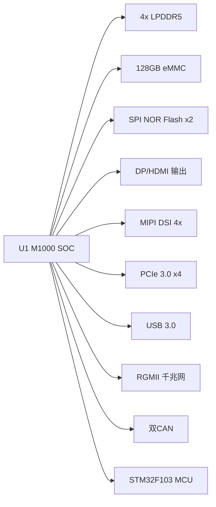

# M20 模组

基于 **M1000 SOC** 的高性能嵌入式计算机模块，适用于 AI 推理、机器视觉、工业控制等场景。

## 硬件架构

| 模块 | 说明 |
|------|------|
| **M1000 SOC** | 主处理器，集成 CPU/GPU/NPU，负责核心计算与显示 |
| **存储子系统** | 4x LPDDR5 + 128GB eMMC + 双 SPI NOR Flash |
| **STM32 MCU** | 系统管理协处理器，负责电源时序、复位、温度监控 |
| **电源管理** | 多级 DC-DC (BPD60320/BPD95025/BPD80690 系列)，独立 CPU/GPU/NPU 供电域 |

## 快速规格

| 项目 | 规格 |
|------|------|
| SOC | M1000 (CPU + GPU + NPU) |
| 内存 | 4x LPDDR5 (Samsung K3LKCKC0BM-MGCP) |
| 存储 | 128GB eMMC + 256Mb NOR Flash + 8Mb NOR Flash |
| 显示 | DP 4-Lane + HDMI (CS5363AN) + MIPI DSI 4x |
| 网络 | RGMII 千兆以太网 |
| USB | USB 3.0 (uPD720201K8) + USB 2.0 OTG |
| 扩展 | PCIe 3.0 x4 |
| CAN | 双 CAN 2.0 (CH9431T) |
| MCU | STM32F103C8T6 (Cortex-M3) |
| 时钟 | 25MHz 主晶振 + PCIe 时钟缓冲器 (RS2CG1808ZL) |

## 文档索引

- [原理图分析](1_原理图)
  - [M20 系统级电路分析报告](1_原理图/M20_overview_analysis)
  - [低速接口](1_原理图/low_speed_interface)
    - [CAN 调试](1_原理图/low_speed_interface/can)
- [测试记录](2_测试记录)
  - [M20_007 上电问题](2_测试记录/0_问题记录/M20_007上电问题)
  - [M20_009 单片机问题](2_测试记录/0_问题记录/M20_009单片机问题)
  - [M20 CAN 接口调试](2_测试记录/0_问题记录/M20_CAN接口调试)