# CPU_CARRIER_MXM_V10 载卡原理图深度分析

## 文档信息

- - **分析日期**: 2026-06-30
- - **载卡原理图**: CPU_CARRIER_MXM_V10-260520.pdf
- - **网表来源**: Cadence OrCAD -> Allegro PST 网表导出
- - **板卡名称**: CPU_CARRIER_MXM_V10 (CPU 载卡)
- - **模组标准**: MXM 3.8A (Mobile PCI Express Module)
---

## 一、系统架构概述

CPU_CARRIER_MXM_V10 是一块基于 **Intel Meteor Lake-U/H 平台** 的 MXM 载卡，作为 TY1200 模组的系统控制与接口扩展核心。设计采用 MXM 3.8A 标准，通过 314 针 MXM 连接器与 GPU 核心板 (MR100) 互联。

### 1.1 整体拓扑

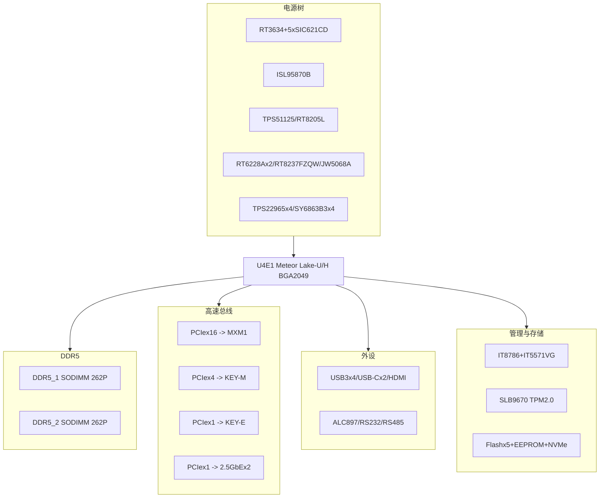

**系统通信与数据流概述**

CPU_CARRIER_MXM_V10 的设计以 U4E1 (Meteor Lake-U/H SoC) 为中心枢纽，所有子系统均通过 SoC 内部总线或专用高速接口进行数据交换。整体数据流分为三层：

- **计算层** — SoC 通过 5 相 VRM (RT3634+SIC621CD) 获取核心供电并执行 DVFS 动态调频，通过双通道 DDR5 (每通道 64bit 数据) 获取最高 5600MT/s 的内存带宽。
- **高速互联层** — PCIe Gen4/5 Root Complex 分配 16 条 Lane 至 MXM (~32GB/s)，4 条至 M.2 NVMe (~8GB/s)，各 1 条至 WiFi 和双 2.5GbE。每一路 PCIe 端点均有独立的 REFCLK 时钟。
- **外设 IO 层** — USB 3.x (5Gbps x4)、USB-C PD (双口 100W)、HDMI 2.x、HD Audio 等通过 SoC 内部 PCH 桥接。

管理子系统 (IT8786+IT5571VG 双 EC) 通过 eSPI 总线与 SoC 通信，负责电源时序、热管理和低速 GPIO 控制。TPM 2.0 通过专用 SPI 片选与 SoC 连接，提供可信计算根。

### 1.2 子系统索引

| 章节 | 子系统 | 关键器件 | 网络数 |
|:----:|--------|---------|:-----:|
| 2.1 | CPU/SoC 核心 | U4E1 (Meteor Lake U/H) | 665 |
| 2.2 | 时钟系统 | Y1~Y13 | 60 |
| 2.3 | 电源管理 | RT3634+SIC621CDx5+... | 91 |
| 2.4 | DDR5 内存 | DDR5_1/DDR5_2 SODIMM | 212 |
| 2.5 | PCIe 互联 | MXM1+KEY-M+KEY-E | 110 |
| 2.6 | 以太网 | U27/U32 (I225-V) | 38 |
| 2.7 | USB 与显示 | USB3_1~4+TYPE-C1/2+HDMI1 | 133+ |
| 2.8 | 音频 | U18 (ALC897) | 17 |
| 2.9 | 串行通信 | U9+U21+U47 | 196 |
| 2.10 | 管理与安全 | IT8786+IT5571VG+SLB9670 | - |
| 2.11 | 存储 | 25Q256+Flashx4+EEPROM+NVMe | 44 |
---

## 二、关键子系统详细分析

### 2.1 CPU/SoC 核心 - U4E1 Meteor Lake-U/H

**基本参数**: BGA 2049 封装 / 参考设计 MT800EAW / 原理图主第 3 页起

#### 2.1.1 CPU 信号总览

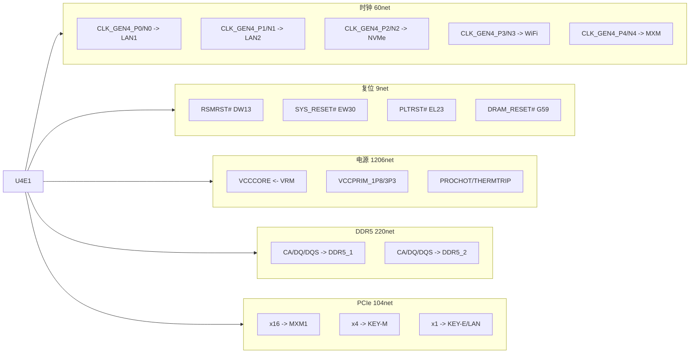

**CPU 信号域说明**

U4E1 的 665 条网络可归纳为 6 个信号域，每个域有独立的设计约束：

- **时钟域 (60net)** — CLKOUT_GEN4/5 为差分时钟输出，经 PCB 走线送至各 PCIe 端点。Gen4 时钟速率 <= 16GHz，Gen5 <= 32GHz，对 PCB 阻抗和等长有严格要求。
- **复位域 (9net)** — 遵循 Intel 平台复位层级：RSMRST#(恢复) -> SYS_RESET#(系统) -> PLTRST#(平台) -> DRAM_RESET#(内存)。上电时 IT5571VG EC 按此顺序依次释放。
- **电源域 (1206net)** — 含 BGA 的多引脚并联供电 (VCCCORE 约 60+ 引脚)，通过 PCB 内层大面积铜皮连接至 VRM 输出端。PROCHOT# 和 THERMTRIP# 是 SoC 到 EC 的热保护上行信号。
- **高速信号域 (DDR5/PCIe/USB)** — 均为高速差分信号域，需控制特征阻抗 (DDR5 40Ohm, PCIe 85Ohm, USB 90Ohm) 并做等长匹配。

#### 2.1.2 管理总线与调试接口

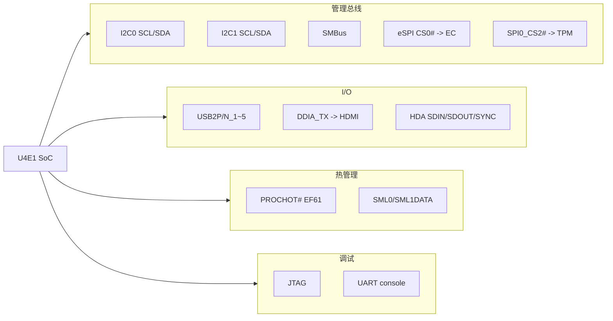

**管理总线与低速接口通信**

SoC 通过以下低速总线与板载外设通信：

- **I2C0/I2C1 (400kHz/1MHz)** — 连接温度传感器、PD 控制器 (CYPD6X27)、EEPROM (AT24C02) 等低速配置器件。I2C0 为主管理通道，I2C1 为辅助通道。
- **SMBus (100kHz)** — 连接 MXM 接口的 SMB_CLK/DATA，用于 GPU 核心板在线识别和状态监控；也连接 VR 控制器的 SML0/SML1 接口做电压遥测。
- **eSPI (66MHz)** — 取代传统 LPC 总线，作为 SoC <-> IT5571VG EC 的主通信通道，传输 ACPI 命令、键盘扫描码、电池状态等。CS0# 为主片选，ALERT0 为 EC 主动上报中断线。
- **SPI0_CS2#** — 专用于 TPM 的 SPI 片选信号，独立于 BIOS Flash 的 SPI 通道，保证安全器件隔离访问。
- **热管理上行** — PROCHOT# 和 THERMTRIP# 为 SoC 到 EC 的硬连线告警，不经过总线。
- **调试接口** — JTAG (5 线) 用于 XDP 处理器调试，UART 提供 console 串口输出。

---

### 2.2 时钟系统

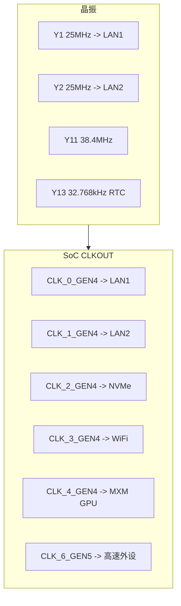

**时钟分发策略**

本设计采用 SoC 集中时钟源 + 扇出分发架构：

- 6 颗外部晶振提供基础频率参考。其中 32.768kHz (Y13) 为 RTC 专用，由 +V1P5A_RTC 常开电源域供电，确保系统断电后时钟不丢失。
- SoC 内部 PLL 将晶振频率倍频至各接口所需时钟，通过 CLKOUT_GEN4/5 引脚差分输出。
- 集中架构的优势：
  - 各 PCIe 端点的 REFCLK 同源，避免跨时钟域问题
  - Gen4/Gen5 支持 Spread Spectrum (展频) 以降低 EMI
  - CLKREQ# 机制允许各端点在空闲时关闭 PCIe 时钟以节省功耗
- 25MHz 晶振 (Y1/Y2) 同时作为 I225-V 网卡 PHY 参考时钟源，两路独立晶振保证双网口的时钟隔离。

---

### 2.3 电源管理子系统

#### 2.3.1 电源树

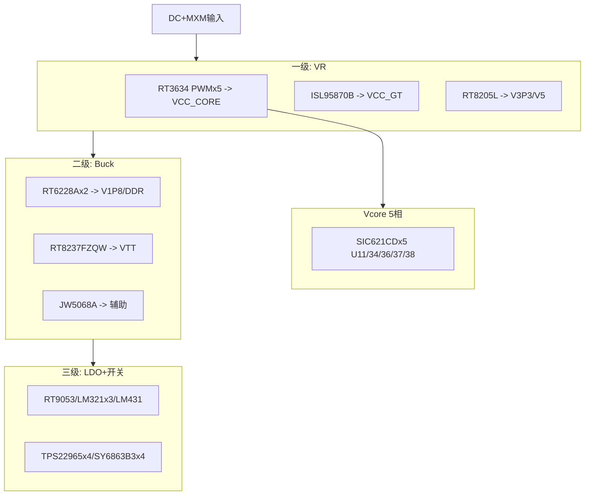

**电源架构设计思路**

CPU_CARRIER_MXM_V10 的电源树采用三级级联转换架构，平衡效率与噪声：

- **第一级 — VR Controllers**
  - RT3634 是 Richtek 多相 PWM 控制器，通过 5 相并联分摊 CPU Vcore 电流 (预估 60A+ 峰值)
  - 每相 SIC621CD DrMOS 集成驱动和 MOSFET，相间交错 72 度降低输入纹波
  - ISL95870B 独立管理 GPU Tile 供电，支持 IMVP9 协议
  - RT8205L 是 3.3V/5V 双路控制器，为全板数字和外设供电

- **第二级 — Buck Converters**
  - RT6228A (8A 同步 Buck) 将 5V/12V 转为 1.8V 和 DDR 辅助电压
  - RT8237FZQW 专用于 DDR5 VTT 终端电压 (VDDQ/2)，必须严格跟随 VDDQ 变化

- **第三级 — LDO + 负载开关**
  - RT9053 低噪声 LDO 为 PLL 和模拟电路供电
  - TPS22965 负载开关实现电源轨按需使能 (如 USB VBUS 仅在设备插入时导通)
  - SY6863B3 提供可调限流保护

- **关键设计约束** — VCCCORE 和 VCC_GT 的电压由 SoC 通过串行 VID 总线动态调节 (DVFS)，VR 控制器必须在微秒级响应 VID 变化。PCB 功率级输出至 BGA 引脚的回流路径需大面积铜皮和多层并联过孔，直流阻抗 < 0.5mOhm。

#### 2.3.2 电源轨清单

| 电源轨 | 电压范围 | 控制器 | 功率级 | 主要负载 |
|---|:---:|:---:|:---:|:---:|
| +VCCCORE | 0.6~1.2V | RT3634 | SIC621CDx5 | CPU核心 DVFS |
| +VCC_GT | 0.6~1.1V | ISL95870B | 集成 | GPU Tile |
| +V3P3A | 3.3V | RT8205L | - | 系统IO外设 |
| +V5A | 5V | RT8205L | - | USB/音频 |
| +V1P8A | 1.8V | RT6228A | - | PLL/IO/TPM |
| +V1P5A_RTC | 1.5V | LDO | - | RTC域 |
| DDR_VTT | 0.6V | RT8237FZQW | - | DDR5终端 |
| +MXM_V12S | 12V | - | - | GPU核心板 |

#### 2.3.3 上电时序

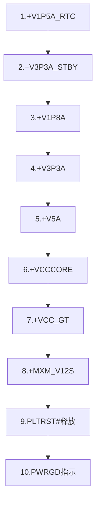

**上电时序的设计考量**

IT5571VG EC 通过 GPIO 和 VR 使能引脚控制全板 10 步上电流程：

- **Step 1** — 常开域优先：+V1P5A_RTC 在插入电源即上电，为 RTC 和 EC 待机域供电，确保 EC 能在 S5 状态下响应电源按钮。
- **Step 2** — 待机域：+V3P3A_STBY 为 EC 全功能供电，EC 固件开始执行。
- **Step 3~8** — 主电源域：从低电压到高电压逐级使能，避免大电流浪涌。VCCCORE 在 Step 6 最后上电，因为 CPU 是最大负载。
- **Step 9~10** — 复位释放：PCH_PLTRST_N 释放后 SoC 开始执行 Boot ROM，随后 PWRGD 信号指示全板电源就绪。

时序间隔通常为 1-5ms，EC 在每一步后检测 PGOOD，任意一步失败则触发保护断电。

---

### 2.4 DDR5 内存子系统

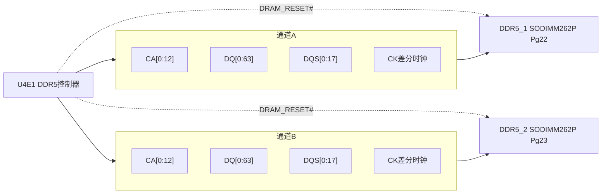

**DDR5 双通道数据流**

SoC 集成双通道 DDR5 内存控制器，每通道独立连接一个 SODIMM 插槽：

- **命令地址 CA[0:12]** — SDR 模式，速率与 CK 时钟同步。DDR5 采用单端 CA 信号，片内端接 (ODT) 由 SoC 寄存器配置。
- **数据 DQ[0:63] + 选通 DQS[0:17]** — DDR 模式 (双沿采样)。写方向 SoC -> SODIMM，读方向 SODIMM -> SoC，DQS 作为源同步时钟。
- **差分时钟 CK_t/CK_c** — 由 SoC 输出，经 fly-by 拓扑到达 SODIMM 各颗粒。DDR5 典型速率 4800~5600MT/s。
- **DRAM_RESET#** — 由 SoC 直接控制，不经 EC，保证内存初始化的低延迟。
- **供电** — VDD (1.1V 核心)、VDDQ (1.1V I/O)、VPP (1.8V 字线升压)、VTT (0.55V 终端)，均由板上 VR 提供。

> PCB 设计要求：CA 总线等长 <10mil，DQ 组内等长 <5mil，线间距 >= 2W 以减少串扰。

---

### 2.5 PCIe 互联拓扑

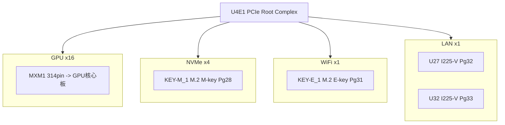

**PCIe 数据流与带宽分配**

SoC PCIe Root Complex 的 16+ 条 Lane 分配如下：

| 链路 | Lane 数 | 速率 | 单向带宽 | 用途 |
|------|:------:|------|:-----:|------|
| MXM1 (GPU) | 16 | Gen4/5 | 32/64 GB/s | 图形渲染、显存 DMA |
| KEY-M (NVMe) | 4 | Gen4 | 8 GB/s | 系统盘读写 |
| KEY-E (WiFi) | 1 | Gen3 | 1 GB/s | 无线网络 |
| LAN1 (I225-V) | 1 | Gen3 | 1 GB/s | 2.5GbE 网络 |
| LAN2 (I225-V) | 1 | Gen3 | 1 GB/s | 2.5GbE 网络 |

- GPU 通过 PCIe DMA 直接读写系统内存 (GART/GTT 映射)，无需 CPU 参与大数据搬运。
- NVMe 支持 NVMe 1.4，典型顺序读 ~7GB/s。
- 2.5GbE 实际有效吞吐 ~2.3Gbps，远小于 PCIe Gen3 x1 带宽。
- 每条链路有独立 REFCLK，支持 ASPM 空闲降速省电。

---

### 2.6 以太网子系统 (双 2.5GbE)

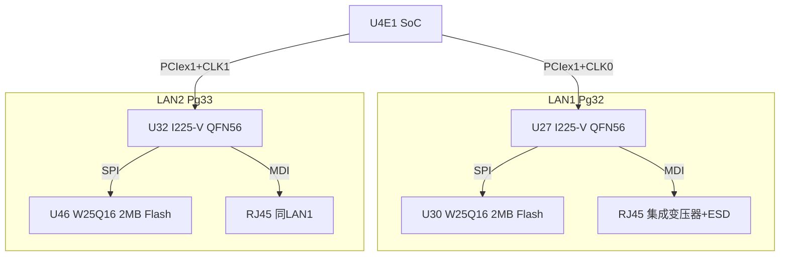

**双网口数据链路**

每路 2.5GbE 的完整数据流路径：

```
SoC <-> PCIe Gen3 x1 <-> I225-V MAC/PHY <-> MDI[0:3] <-> RJ45(变压器) <-> 网线
```

- **PCIe 侧** — I225-V 作为 PCIe 端点，SoC 通过 DMA 描述符环收发以太网帧。支持 MSI-X 中断合并和 RSS 多队列分流，减少 CPU 中断开销。
- **MDI 侧** — 4 对差分线支持 10M/100M/1G/2.5G 自适应。2.5G 模式下使用 PAM-16 调制 (vs 1G 的 PAM-5)。I225-V 内置 DSP 做回波消除和串扰抵消。
- **SPI Flash** — 每颗 I225-V 外挂 2MB SPI Flash，存储 PXE ROM 固件和 MAC 地址。Flash 通过 I225-V 的 SPI 主控制器访问，与 SoC 的 SPI 总线隔离。
- **LED 指示** — LED0 (1000M)、LED1 (2500M)、LED2 (LINK/ACT)，由 I225-V GPIO 直接驱动。

---

### 2.7 USB 与显示子系统

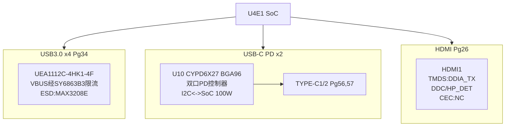

**USB 与显示数据通路**

- **USB 3.x (4端口)** — SoC 内部 xHCI 控制器管理 4 个 USB 端口。USB 2.0 (480Mbps) 使用 DP/DM 单端信号，USB 3.x SuperSpeed (5Gbps) 使用独立 SSRX/SSTX 差分对。VBUS 经 SY6863B3 限流开关 (典型 900mA/端口) 供电，支持 BC 1.2 充电协议检测。

- **USB-C PD (双口)** — CYPD6X27 (U10) 是 Cypress 可编程 PD 控制器，通过 I2C 与 SoC 通信协商供电策略。单芯片管理两个 Type-C 端口，各端口 VBUS 经独立 MOSFET 输出，支持 5V/9V/15V/20V 共 100W (20V@5A) PD 3.0 输出。同时支持 DP Alt Mode，USB-C 可作为 DisplayPort 输出复用接口。

- **HDMI** — SoC 的 DDIA 数字显示接口输出 4 对 TMDS 差分信号至 HDMI 连接器。DDC (I2C over HDMI) 用于 EDID 读取和 HDCP 密钥交换。HP_DET (Hot Plug Detect) 为 5V 电平，SoC 通过此信号检测显示器插入/拔出。CEC 引脚在本设计中悬空 (NC)，未使用消费电子控制功能。

---

### 2.8 音频子系统

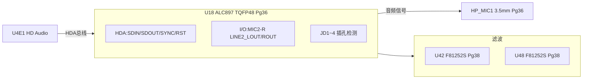

**HD Audio 数据流**

ALC897 通过 Intel HD Audio (Azalia) 总线与 SoC 连接：

- **HDA 总线 (5 线)**
  - SDOUT (SoC -> Codec) — 携带 PCM 音频流和配置命令
  - SDIN0/SDIN1 (Codec -> SoC) — 两路独立输入，分别用于前端 MIC 和后端 LINE IN
  - SYNC (48kHz) — SoC 发出的帧同步信号，定义每帧 1 个采样周期
  - BCLK (24.576MHz = 512 x 48kHz) — 位时钟，由 Codec 或 SoC 产生
  - RST# — SoC 控制 Codec 硬件复位

- **模拟前端** — Codec 内部 DAC 将数字音频转为模拟信号，经 LINE2_LOUT/ROUT 输出至 HP_MIC1 3.5mm 插孔。MIC 输入经 Codec 内部 ADC (24bit/192kHz) 数字化后通过 SDIN 回传 SoC。

- **插孔检测 (JD1~JD4)** — 4 路检测信号可识别 4 种插头类型 (纯耳机/纯麦克风/复合/空)，Codec 据此自动切换内部信号路由。

- **电源滤波** — U42/U48 (F81252S) 滤波器抑制音频电源轨上的开关噪声，保证模拟信噪比。

---

### 2.9 串行通信子系统

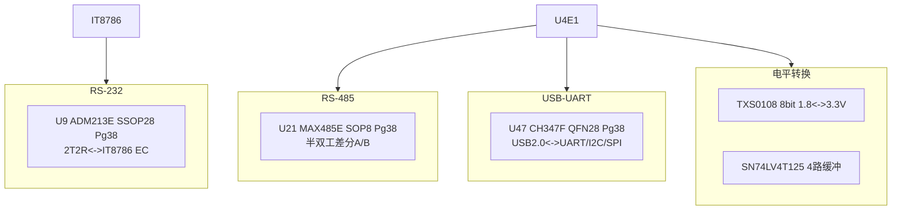

**串口数据通路**

- **RS-232** — IT8786 EC 的 UART 通过 ADM213 电平转换后输出标准 RS-232 (+/-12V 电平)。2T2R 配置支持 TXD/RXD + RTS/CTS 硬件流控。典型用途为调试 console 或连接工业设备。

- **RS-485** — SoC 直接控制 MAX485 半双工收发器，通过 GPIO 切换收发方向。差分 A/B 信号经 120Ohm 终端电阻匹配，支持长距离 (1km+) 多点通信。典型用途为工业现场总线 (Modbus RTU 等)。

- **USB-UART** — CH347F 是 USB 2.0 全速 (12Mbps) 转 UART/I2C/SPI 桥接芯片，连接到 SoC 的一个 USB 端口。用于固件烧录或外接调试工具，不需要外部串口线缆。

- **电平转换** — TXS0108 8 位双向电平转换器解决 1.8V/3.3V 跨域通信问题，SN74LV4T125 提供 4 路同相缓冲增强驱动能力。

---

### 2.10 管理与安全子系统

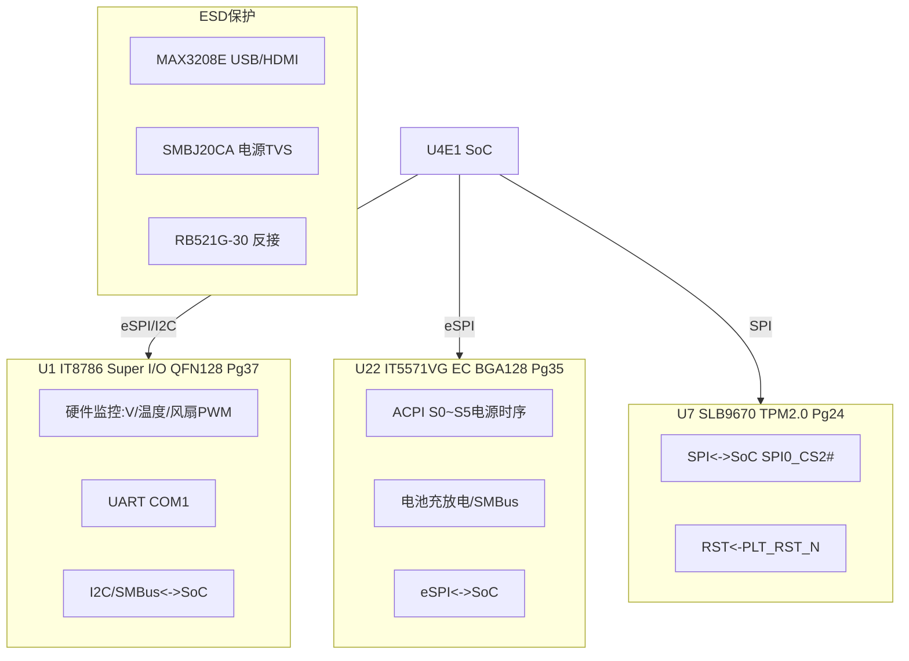

**双 EC 管理架构说明**

本设计采用 IT8786 + IT5571VG 双 EC 架构，是 PC 主板级方案的典型配置：

- **IT5571VG (主 EC)** — 通过 eSPI 与 SoC 直连，运行 EC 固件负责 ACPI S0~S5 电源状态切换。逐脚控制各 VR 的使能和 PGOOD 检测，实现精确的上电/掉电时序。同时管理电池充放电 (SMBus 连接充电 IC) 和键盘/触摸板 (PS2/LPC 接口)。

- **IT8786 (Super I/O)** — 通过 I2C/SMBus 与 SoC 通信，专注于硬件监控 (多路 ADC 采集电压/温度) 和风扇 PWM 控制。提供 COM1 UART 用于调试输出。其独立性保证了即使主 EC 异常，硬件监控功能仍可工作。

- **SLB9670 TPM 2.0** — Infineon Optiga 系列，通过专用 SPI 片选 (SPI0_CS2#) 与 SoC 通信。支持 SHA-256、RSA-2048、ECC 等密码算法。复位来自平台复位 (BUF_PLT_RST_N)，掉电后内部密钥不会丢失。

- **ESD 分级保护** — MAX3208E (结电容 <0.5pF) 用于 HDMI/USB 等高速差分接口，不影响信号质量。SMBJ20CA (600W) 用于电源输入，肖特基二极管用于反接保护。

---

### 2.11 存储子系统

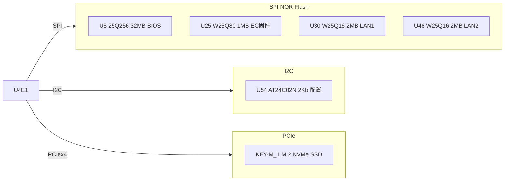

**固件与数据存储布局**

存储子系统按功能和访问路径分为四层：

- **BIOS/系统固件 (U5, SPI)** — 32MB SPI NOR Flash 存放 UEFI BIOS 镜像。SoC 上电复位后直接通过 SPI 控制器读取并映射到内存执行 (XIP)。Flash 的 HOLD#/WP# 引脚由 SoC GPIO 控制，防止误写。

- **EC 固件 (U25, SPI)** — 1MB Flash 存放 IT5571VG EC 固件。EC 上电后从自己的 Flash 加载代码，独立于主 BIOS。这种分离设计允许 EC 固件和主 BIOS 各自独立更新。

- **网卡固件 (U30/U46/U31, SPI)** — 各 1~2MB Flash 存放 I225-V 的 PXE ROM 和 NVM 配置 (MAC 地址等)。两个网口的 Flash 物理独立，即使一颗 Flash 损坏也不影响另一网口。

- **配置存储 (U54, I2C)** — 2Kb EEPROM 存放板卡序列号、MAC 地址、OEM 配置等小量数据，断电不丢失，且不需要擦除扇区 (与 Flash 区别)。

- **大容量存储 (KEY-M, PCIe)** — M.2 NVMe SSD 提供 GB~TB 级存储，作为系统的操作系统和数据存储介质。PCIe x4 链路保证 ~7GB/s 的顺序读带宽。

---

## 三、MXM 3.8A 接口分析

### 3.1 连接器规格

| 属性 | 内容 |
|---|:---:|
| 设计ator | MXM1 |
| 型号 | AS0B821-S55B-7H |
| 引脚数 | 314 (A+B双排) |
| 标准 | MXM 3.8A |
| 位置 | Pg58 |

### 3.2 信号分配 -> GPU 核心板 MR100

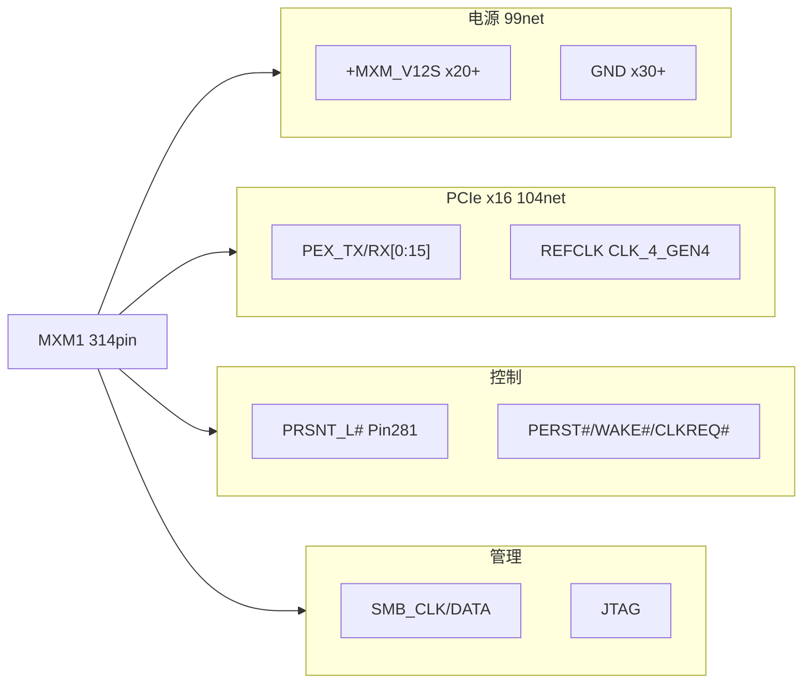

**MXM 信号接口说明**

MXM1 314pin 连接器是 CPU 载卡与 GPU 核心板之间的唯一物理和电气接口：

- **电源 (99net)** — +MXM_V12S 经 20+ 引脚并联传输 12V 主供电至 GPU 核心板。单个 MXM 引脚额定电流 ~0.5A，总供电能力 >100W。GND 引脚 30+ 个，既提供回流路径也起散热作用。

- **PCIe x16 (104net)** — 16 对发送 (TX) + 16 对接收 (RX) = 64 根差分线组成完整 x16 链路。MXM 3.8A 标准严格定义各 lane 的引脚位置，确保载卡和核心板的物理兼容性。PEX_REFCLK 差分对提供 100MHz 参考时钟。

- **控制信号** — PRSNT_L# (低有效) 用于 SoC 检测 GPU 核心板是否在位，通常通过 GPU 板上的接地实现。PERST# 是 PCIe 功能复位，WAKE# 允许 GPU 唤醒休眠中的 SoC，CLKREQ# 用于 PCIe 时钟电源管理。

- **管理总线** — SMBus 用于载卡读取 GPU 板的 FRU 信息 (厂商 ID、型号、功耗等级等)。JTAG 用于 GPU 调试，通常仅在开发阶段使用。

> MXM 3.8A 是一个成熟的工业标准，本设计的引脚分配遵循标准规范，确保与不同厂商 GPU 核心板的互操作性。

---

## 四、信号统计

### 4.1 按协议分类

| 信号类别 | 网络数 | 说明 |
|---|:---:|:---:|
| DDR5 | 212 | 双通道 SODIMM |
| UART/TBT | 185 | 调试串口+Thunderbolt |
| USB | 133 | 含 USB-C PD |
| PCIe | 110 | x16+x4+x1x3 |
| 电源 | 91 | 含 GND(2329节点) |
| 时钟 | 60 | Gen4/5差分输出 |
| SPI/eSPI | 44 | BIOS/EC/TPM/网卡 |
| 以太网MDI | 38 | 双2.5GbE |
| 控制/复位 | 37 | 各路复位和电源控制 |
| GPIO | 29 | 通用IO |
| I2C/SMBus | 26 | 管理总线 |
| 音频HDA | 17 | ALC897 |
| CAN/串口 | 11 | RS-232/485 |
| JTAG | 8 | 调试 |
| SATA | 2 | 保留 |

### 4.2 器件分布

| 类别 | 数量 | 占比 |
|---|:---:|:---:|
| 电阻 | 976 | 45.5% |
| 电容 | 798 | 37.2% |
| 二极管/TVS | 109 | 5.1% |
| 电感/磁珠 | 108 | 5.0% |
| MOSFET/晶体管 | 72 | 3.4% |
| IC | 54 | 2.5% |
| 连接器 | 17 | 0.8% |
| 晶振 | 8 | 0.4% |
| 其他 | 8 | 0.4% |
| 总计 | 2147 | 100% |

---

## 五、网表导出注意事项

来自 netlist.log 的 28 条告警：无引脚器件 BAT1/PCB1 未导出；No_connect 覆盖 HP_MIC1.4/RN1~3 等 DNP 引脚强制连网；Part Name 截断 BATTERY28D8 等；170 条单节点网络 (NC或未连接)。

---

## 六、设计要点总结

### 设计亮点

- 1. **5 相 DrMOS Vcore** - RT3634+SIC621CDx5，支持 Meteor Lake DVFS
- 2. **双 EC 冗余管理** - IT8786 (硬件监控) + IT5571VG (ACPI时序) 分工明确
- 3. **丰富高速接口** - PCIe x16 GPU + x4 NVMe + x1 WiFi + x2 2.5GbE
- 4. **USB-C PD 双口** - CYPD6X27 双 PD 控制器，100W PD 3.0 + DP Alt Mode
- 5. **完整安全链** - TPM2.0 (SLB9670) + 多级 ESD + 过流过温保护
### 技术规格总表

| 项目 | 规格 | 备注 |
|---|:---:|:---:|
| 平台 | Intel Meteor Lake-U/H | BGA2049 |
| 内存 | DDR5 SODIMMx2 | 双通道262P |
| 存储 | 32MB SPI+M.2 NVMe | BIOS+SSD |
| 网络 | 2x2.5GbE I225-V | RJ45各配2MB Flash |
| USB | 4xUSB3+2xUSB-C PD | USB-C 100W |
| 显示 | HDMI2.x | DDIA输出 |
| 音频 | ALC897 HD Audio | 3.5mm复合 |
| 安全 | TPM2.0 SLB9670 | SPI接口 |
| 管理 | IT8786+IT5571VG | eSPI+LPC |
| Vcore | 5相DrMOS | 0.6~1.2V DVFS |
| GPU链路 | MXM3.8A x16 Gen4 | 314pin |

---

*本分析基于 Cadence OrCAD 导出的 Allegro PST 网表解析生成。所有结构图采用 Mermaid 格式，建议使用支持 Mermaid 渲染的编辑器查看。*

